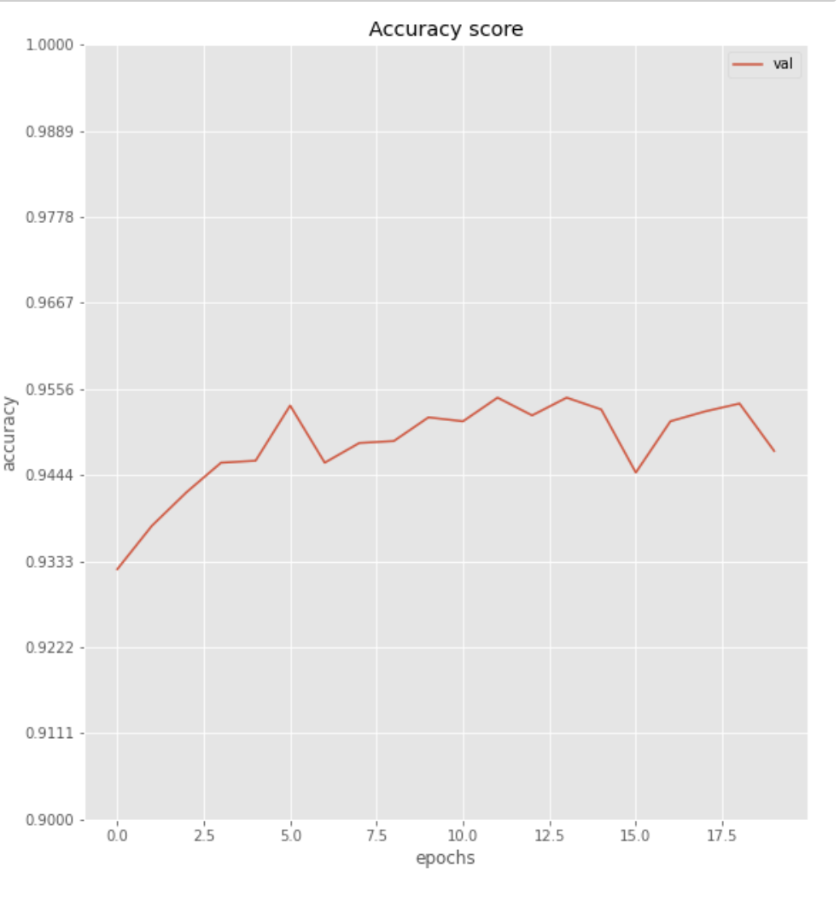

# doggy_transfer_learning
#### Solution for [ImageWoof dataset](https://github.com/fastai/imagenette) classification problem using `transfer Learning` technique.

## Requirements

```bash
pip3 install torch torchvision tqdm numpy pandas matplotlib seaborn
```
**or**

```bash
pip3 install -r requirements.txt
```

## Usage
Just install `jupyter notebook` and have fun.

## Description of a problem
`Imagewoof` is a subset of 10 classes from Imagenet that aren't so easy to classify, since they're all dog breeds. The breeds are: Australian terrier, Border terrier, Samoyed, Beagle, Shih-Tzu, English foxhound, Rhodesian ridgeback, Dingo, Golden retriever, Old English sheepdog.

There you can see some examples from this dataset (already with augmentation).


## Description of a training process
As this dataset is not so easy to classify even for humans' eyes, I've decided to use pretrained `ResNet50` model as a basic approach. The training data was also augmented and other basic methods were also made.

Whereupon, there are two general steps:
- Firstly, ResNet was used as a `feature extractor`, i. e. all the layers of the net were frozen, the FC was cut off and replaced with a linear layer with required number of out_features. This stage of training lasted for 25 epochs.

- Secondly, It's the time for model `fine-tuning`, but with `discriminative learning rates` technique. The network also trained for 25 epochs.

## Results
Below you can see a plot of an accuracy score for finetuned model on a validation data. In my opinion, it's a good score for such a small time of learning.
But before fine-tuning, when the model was only a feature extractor, accuracy on a test a data was about `0.896156`. I guess, learning only one layer (head) and freezing of a backbone have some limit value of accuracy and for further improvment it's necessary to slightly correct weights on all layers of NN.


